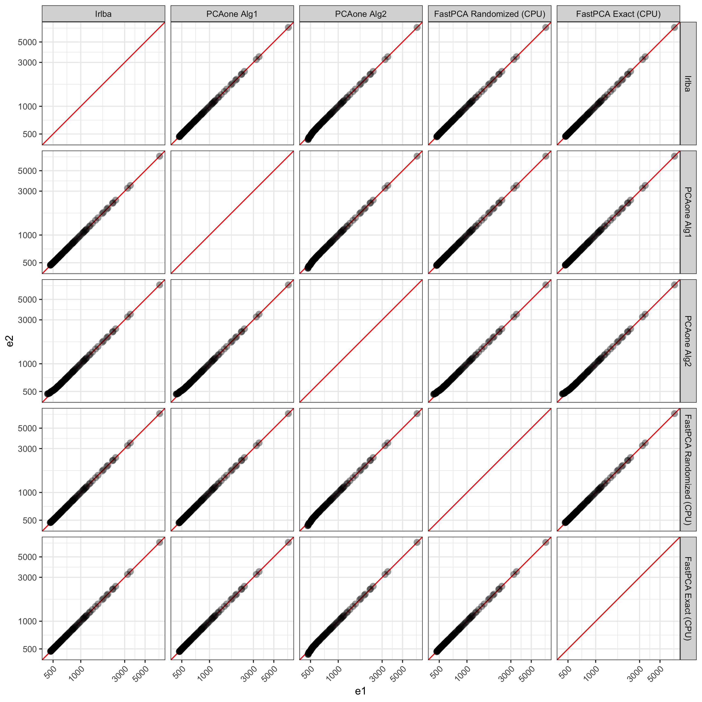

<!-- README.md is generated from README.Rmd. Please edit that file -->

# FastPCA

<!-- badges: start -->

<!-- badges: end -->

The goal of `FastPCA` is to speed up calculations of singular value
decomposition (SVD) by leveraging the large about of work that has gone
into python libraries, specifically PyTorch, for matrix operations.
`FastPCA` offers similar performance to other highly optimized SVD
methods in R (see below) while being an order of magnitude faster.

## Installation

You can install the development version of FastPCA from
[GitHub](https://github.com/) with:

``` r
# install.packages("devtools")
devtools::install_github("ACSoupir/FastPCA")
```

After installation, need to perform setup by either creating a conda
environment with (py)torch and numpy installed, or by running
`FastPCA::setup_py_env()` which will attempt to create an environment
and install the necessary packages. **I recommend using python 3.10 if
you want to leverage `tinygrad` as have noticed issues with device
support with python 3.9.**

### Mac

On Mac if you run into issues, have had luck with installing
[`macrtools`](https://mac.thecoatlessprofessor.com/macrtools/index.html)
with:

``` r
# install.packages("remotes")
remotes::install_github("coatless-mac/macrtools")
```

Then, either installing it’s full set:

``` r
macrtools::macos_rtools_install()
```

or if the error is gfortran related, uninstalling and installing again
with:

``` r
macrtools::gfortran_uninstall()
macrtools::gfortran_install(
    password = base::getOption("macrtools.password"),
    verbose = TRUE
)
```

## Tutorials

Get started running `FastPCA` with the [Using FastPCA on Large
Matrices](https://acsoupir.github.io/FastPCA/articles/intro.html)
vignette.

## Benchmarking against PCAone

Using a matrix that contains 98,647 pixels with 2,925 MALDI peaks, I
have run the
[`PCAone`](https://cran.r-project.org/web/packages/pcaone/index.html)
package with both of their algorithms. For each of the methods, I
calculated 100 dimensions from the data using 10 oversampling dimensions
as well as 10 power iterations. Additionally, I tested the commonly used
[`irlba`](https://cran.r-project.org/web/packages/irlba/index.html)
pacakge using `work=200` for a similar 200 dims in `FastPCA` and
`PCAone`. The speed difference was:

|                          | User Time (s) | System Time (s) | Elapsed Time (s) |
|:-------------------------|--------------:|----------------:|:-----------------|
| Irlba                    |       143.832 |           1.168 | **145.354**      |
| PCAone Alg1              |        44.805 |           0.574 | **45.556**       |
| PCAone Alg2              |        48.518 |           0.743 | **49.446**       |
| FastPCA Randomized (CPU) |        19.898 |           5.227 | **5.306**        |
| FastPCA Randomized (GPU) |         0.799 |           0.638 | **0.939**        |
| FastPCA Exact (CPU)      |        79.694 |          11.564 | **35.819**       |

Memory does appear to be greater when using `FastPCA` over `PCAone`, but
`irlba` also has higher memory usage than both when estimating top
dimensions (except with `FastPCA` estimating all dimensions; profiled
with [`profmem`](https://cran.r-project.org/web/packages/profmem/)):

|                          | Memory   |
|:-------------------------|:---------|
| Irlba                    | 660.3 Mb |
| PCAone Alg1              | 77.5 Mb  |
| PCAone Alg2              | 77.5 Mb  |
| FastPCA Randomized (CPU) | 163.1 Mb |
| FastPCA Randomized (GPU) | 163.1 Mb |
| FastPCA Exact (CPU)      | 4.4 Gb   |

### Results

First exploring the eigenvalues calculated by all methods, on the high
end they are all very similar as expected. `FastPCA` uses essentially
the same method as `PCAone` uses for `'alg1'` so its logical that
`PCAone` with `'alg1'` produces results much more similar to `FastPCA`.
Interestingly, `FastPCA` without random projection and power iterations
produces results more similar to `'alg1'` and `FastPCA`’s Randomized
method. `irlba` also produces resutls very in line with those from the
full output of `FastPCA`’s exact.



The values start to deviate after ~50 dimensions between `PCAone`’s
`'alg2'` compared to `FastPCA` and `irlba`.

| Dimension | Irlba | PCAone Alg1 | PCAone Alg2 | FastPCA Randomized (CPU) | FastPCA Exact (CPU) |
|:---|---:|---:|---:|---:|---:|
| PC45 | 708.8466 | 708.8466 | 708.7793 | 708.8466 | 708.8466 |
| PC46 | 699.7265 | 699.7265 | 698.8108 | 699.7265 | 699.7265 |
| PC47 | 686.3112 | 686.3112 | 686.0771 | 686.3112 | 686.3112 |
| PC48 | 684.1567 | 684.1567 | 684.0269 | 684.1567 | 684.1567 |
| PC49 | 677.2385 | 677.2385 | 677.1451 | 677.2385 | 677.2385 |
| PC50 | 670.5312 | 670.5312 | 669.8761 | 670.5312 | 670.5312 |
| PC51 | 664.5754 | 664.5754 | 664.4825 | 664.5754 | 664.5754 |
| PC52 | 642.7470 | 642.7469 | 642.2740 | 642.7469 | 642.7470 |
| PC53 | 641.3331 | 641.3331 | 640.7761 | 641.3329 | 641.3331 |
| PC54 | 634.0135 | 634.0134 | 633.3070 | 634.0134 | 634.0135 |

Visualizing PCs past 45, we can see the discrepancies better. `PCAone`’s
`'alg2'` shows more deviation from all other methods. Compared to the
Exact solution from `FastPCA`, `irlba`, `PCAone` with `'alg1'`, and
`FastPCA`’s randomized method all match very well up to the 100 PCs
returned.


## Example

``` r
library(FastPCA)

setup_py_env(method = "conda", envname = "FastPCA", cuda = FALSE)

start_dat = readRDS("smalley_maldi_clustering_for_alex_2025-06-06/27213_all_regions-nonorm_norm_filtered.rds")
dim(start_dat)
#2343 x 98647

processed_dat = FastPCA::prep_matrix(as.matrix(start_dat),
                                     log2 = TRUE, 
                                     transpose = TRUE,
                                     scale = TRUE)
dim(processed_dat)
#98647 x 2343

out_svd = FastPCA(processed_dat, 
                  k = 50,
                  p = 10,
                  q_iter = 2)
system.time({
  out_svd = FastPCA(processed_dat, 
                    k = 50,
                    p = 10,
                    q_iter = 2)
})
```

Execution times:

- User - 1.754
- System - 1.845
- Elapsed - 0.648

## Outputs

Outputs are singular values. To convert to scores in R, multiply the
left singular values by the

``` r
torch_pc_scores = get_pc_scores(out_svd)
```
