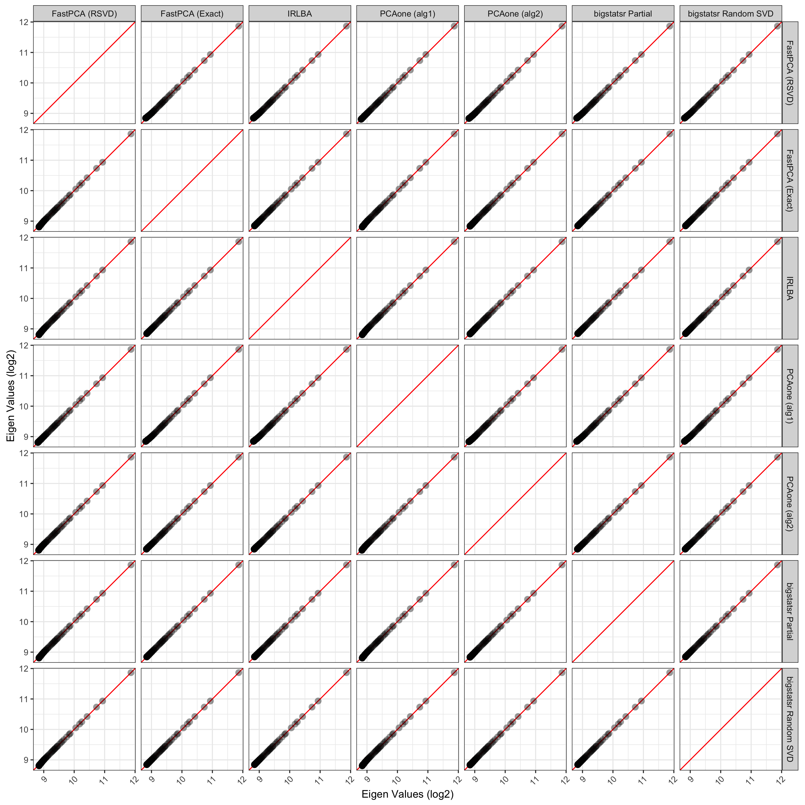

---
# Example from https://joss.readthedocs.io/en/latest/submitting.html
title: '`FastPCA`: An R package for fast single value decomposition'
tags:
  - R
  - Python
  - single-cell
  - multiomics
  - reticulate #?
authors:
  - name: Kimberly R. Ward
    orcid: 0000-0000-0000-0000
    affiliation: 1
  - name: Mitchell Hayes
    orcid: 0000-0000-0000-0000
    affiliation: 2
  - name: Steven Eschrich
    orcid: 0000-0000-0000-0000
    affiliation: 3
  - name: Alex C Soupir
    orcid: 0000-0000-0000-0000
    affiliation: "2, 3" # (Multiple affiliations must be quoted)
affiliations:
  - name: Department of Cutaneous Oncology, Moffitt Cancer Center
    index: 1
  - name: Department of Genitourinary Oncology, Moffitt Cancer Center
    index: 2
  - name: Department of Bioinformatics and Biostatistics, Moffitt Cancer Center
    index: 3
citation_author: Ward, Hayes, and Soupir
date: "`r format(Sys.time(), '%d %B, %Y')`"
year: "`r format(Sys.time(), '%Y')`"
bibliography: paper.bib
output: rticles::joss_article
csl: apa.csl
journal: JOSS
---

# Summary

The `FastPCA` package provides an interface to optimized matrix multiplication libraries (`libtorch`) for the purpose of singular value decomposition. Using `FastPCA` to perform randomized singular value decomposition (SVD) drastically reduces the time. Developed for biological data such as single-cell RNA-seq, spatial transcriptomics, or matrix-assisted laser desorption/ionization, `FastPCA` can accurately identify the top singular values in high dimensional data.

# Statement of Need

The scale of biological data has increased substantially in recent years (@Lim2025-vb). Advances in single-cell technologies and spatially resolved assays such as matrix-assisted laser desorption/ionization (MALDI) imaging have enabled the collection of datasets with tens of thousands of cells or pixels and thousands of measured features per sample (@Zaima2010-gy). The current way that these data are processed in R is with dimensionality reduction bringing the feature space down to tens or hundreds of features. However, this is typically done with packages like `irlba` (@Baglama2011-ob) where the process of identifying singular values is iterative, meaning single-thread limited. There are faster packages like `pcaone` (@Li2023-aa) which provides an API for R, but is not multithreaded without modification to the source code. The `qrpca` R package (@De_Souza2022-lk) uses the `torch` (@Falbel2020-wq; @Paszke2019-go) to perform QR based principal component analysis, but doesn't produce reduces space singular values resulting in incredibly large memory requirements for large matrices like those in biological studies with hundreds of thousands of samples (i.e., spots, cells, pixels, etc) and thousands of features (i.e., genes, peaks, etc). To quickly iterate and identify parameters that are biologically relevant (i.e., separate cell types, appropriate normalizations, etc), a faster, more adaptable package is needed for the R environment where these types of analyses are performed.

The `FastPCA` R pacakge was developed to address this critical need. `FastPCA` has access to the `torch` backend through R, as well as `pytorch` with `reticulate` (@Ushey2017-mx). We've also included vignettes to demonstrate `FastPCA`'s utility and functionality (<https://acsoupir.github.io/FastPCA/>).

# Functionality

`FastPCA` will default to using `irlba` if the backend is set to `r` but through setting the backend to `torch` or `pytorch`, will use the `libtorch` through different APIs (R or python). Largest flexibility is found through `pytorch` or `torch` since the initial function call will allow setting the number of threads to use for matrix operations. There are two functions within `FastPCA` that aid in the setup of the environments:

-   `setup_py_env()`: creates a python environment (either with 'conda' or 'virtualenv') for using in the event that `pytorch` is wanted for the backend
-   `start_FastPCA_env`: starts the environment created with `setup_py_env()` to use for `pytorch` backend

Then, there are processing functions that work on input matrices or intermediate lists produced by `FastPCA`:

-   `prep_matrix()`: aids in transformation like log2 and scaling while also providing a single function to transpose the data into the needed orientation for `FastPCA()` (rows as samples, columns as features)
-   `FastPCA()`: performs either exact SVD (though not recommended other than benchmarking) or reduced-dimension singular value decomposition with `irlba` or randomized SVD
-   `get_pc_scores()`: calculates the principal component scores from the output of SVD ($U$ matrix which contains left sinular vectors, $\Sigma$ vector containing the singular values, and $V^T$ matrix of the left singular vectors) which are typically expected for downstream analyses
-   `umap()`: uses either `uwot` (R) or `uwot-learn` (python) for visualization of the principal component scores

# Demonstration of Improvement

To demonstrate the improvements of `FastPCA`, we use our previous data set of single-cell spatial transcriptomics of kidney cancer. The dataset is publically available on [Zenodo](https://zenodo.org/doi/10.5281/zenodo.12730226) and can be downloaded locally to be used (@Soupir2024-ww). Since the main benefits of `FastPCA` is in the it's application of singular value decomposition, that is what will be focused on. The counts for each cell was extracted from the Seurat object in the Nanostring assay which contains the expression of 978 probes (959 genes, 19 negative control probes) in 199,112 cells. Normalization was performed using `prep_matrix()`, apply a log transformation, scaling (mean centering and unit variance), and transposing for samples to be rows and columns to be the gene features. The full script can be found <https://github.com/ACSoupir/FastPCA/docs_acs/paper/benchmarking_script.R>.

Running `FastPCA`, both randomized SVD and exact, `irlba`, `pcaone`, and `bigstatsr`, both partial and partial random SVD, was profiled on an M3 Pro MacBook Pro with 36GB unified RAM. `FastPCA` by default uses 4 CPU cores while the others are single threaded (with the acception of bigstatsr random SVD which does appropriately use mulitiple threads). Time was profiled with the base `system.time()` function. The elapsed time of `FastPCA` calculating the singular value decomposition on the full data took 10.55 seconds and the randomized SVD with `FastPCA`taking 7.63 seconds (Table 1). The next fastest were the methods with PCAone which took 31.35 and 32.75 seconds for "alg1" and "alg2", respectively.

| Method                 | User Time (s) | System Time (s) | Elapsed Time (s) |
|------------------------|:-------------:|:---------------:|:----------------:|
| FastPCA (rSVD)         |     29.39     |      3.83       |       7.63       |
| FastPCA (Exact)        |     22.29     |      3.47       |      10.55       |
| IRLBA                  |    477.64     |      11.79      |      490.18      |
| PCAone (alg1)          |     30.26     |      1.10       |      31.35       |
| PCAone (alg2)          |     31.82     |      0.95       |      32.75       |
| bigstatsr (Partial)    |    117.68     |      4.11       |      122.12      |
| bigstatsr (random SVD) |     0.27      |       0.2       |      69.89       |

: Table 1: Time to calculate singular value decomposition using different R packages and methods.

Memory is another area that may dictate methods used. We used `profmem::profmem()` using the same function calls as for time profiling. PCAone (alg1 and alg2) and `bigstatsr` randomized partial SVD used between 152.7 Mb and 163.1 Mb (Table 2). `FastPCA` with calculating randomized SVD used 321.4 Mb and `irlba`, which is often used for single-cell studies with Seurat, consumed 886.2 Mb. Surprisingly, `bigstatsr::big_svd()` used just over 2000 Mb and `FastPCA` calculating the exact SVD matrices used 2986 Mb.

| Method                 | Memory (Mb) |
|------------------------|:-----------:|
| FastPCA (rSVD)         |    321.4    |
| FastPCA (Exact)        |    2986     |
| IRLBA                  |    886.2    |
| PCAone (alg1)          |    152.7    |
| PCAone (alg2)          |    152.7    |
| bigstatsr (Partial)    |   2001.5    |
| bigstatsr (random SVD) |    163.1    |

: Table 2: Memory usage for the calculation of singular value decomposition with different R packages and methods.

Lastly, to assess the quality of the top singular values, we plotted the 100 derived values from all methods against all others. Using the `irlba` as the comparator due to it's common use in workflows for deriving eigenvectors and eigenvalues, we observe that the exact singular values from `FastPCA` are essentially identical, as are those from both `bigstatsr` methods (Figure 1). `FastPCA` using the randomized singular vector approach showed slight deviation in the lower end singular values, though, still maintained high similarity to the exact approach. PCAone with "alg1" also showed a slight deviation from IRLBA while maintaining the main dimensions' singular values.

# Acknowledgements

We would like to thank Dr. Oscar Ospina for his testing of the `FastPCA` in a single-cell workflow to validate it's similarity to values derived from Seurat.

# References
